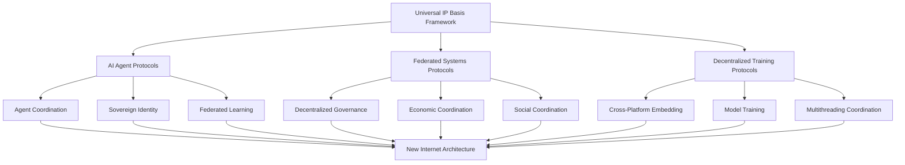

# POSTULATION Protocol Documentation Index

## Overview

This directory contains RFC-style protocol specifications that extend the proven foundations of the MonadFunctorPerceptron protocol into new domains of AI agents, federated systems, and universal IP basis frameworks.

## Core Protocol Specifications

### [RFC-POSTULATION-universal-ip-basis.md](./RFC-POSTULATION-universal-ip-basis.md)
**Status**: Draft  
**Abstract**: Defines the Universal IP Basis Framework enabling any binary data structure to be encoded in any IP address format (IP0-IPN) using modular arithmetic. This is the foundational innovation that enables all other postulations.

**Key Concepts**:
- Modular arithmetic: `PATH.length / 7 = %5 ± {0,1,2,3}`
- Mathematical equivalence across IP levels
- Flexible type system with optional components
- Universal binary transformation

### [RFC-POSTULATION-ai-agents.md](./RFC-POSTULATION-ai-agents.md)
**Status**: Draft  
**Abstract**: Extends RFC2119 for AI agent-specific keywords and defines protocols for autonomous agent coordination, sovereign identity, and federated learning.

**Key Concepts**:
- Sovereign identity protocols
- Agent-to-agent communication
- Federated learning coordination
- Cross-platform agent compatibility

### [RFC-POSTULATION-federated-systems.md](./RFC-POSTULATION-federated-systems.md)
**Status**: Draft  
**Abstract**: Defines protocols for decentralized social-economic systems, governance mechanisms, and economic coordination without central authority.

**Key Concepts**:
- Decentralized governance protocols
- Economic coordination mechanisms
- Social coordination without central platforms
- UDP/HTTP3 binary handshakes

### [RFC-POSTULATION-decentralized-training.md](./RFC-POSTULATION-decentralized-training.md)
**Status**: Draft  
**Abstract**: Specifies protocols for cross-platform, cross-spectrum binary feature embedding and decentralized model training with multithreading coordination.

**Key Concepts**:
- Cross-platform feature embedding
- Decentralized model training
- Multithreading coordination
- Federated provenance proximity

## Supporting Documentation

### [IANA-CONSIDERATIONS.md](./IANA-CONSIDERATIONS.md)
**Status**: Draft  
**Abstract**: Internet Assigned Numbers Authority considerations for new protocol parameters, port assignments, and registry requirements.

### [GLOSSARY.md](./GLOSSARY.md)
**Status**: Draft  
**Abstract**: Comprehensive glossary of terms, concepts, and mathematical notation used throughout the POSTULATION protocol specifications.

## Protocol Relationships

## Implementation Status

| Protocol | Specification | Reference Implementation | Testing | Deployment |
|----------|---------------|-------------------------|---------|------------|
| Universal IP Basis | ✅ Draft | 🚧 In Progress | 🚧 In Progress | ⏳ Planned |
| AI Agents | ✅ Draft | ⏳ Planned | ⏳ Planned | ⏳ Planned |
| Federated Systems | ✅ Draft | ⏳ Planned | ⏳ Planned | ⏳ Planned |
| Decentralized Training | ✅ Draft | ⏳ Planned | ⏳ Planned | ⏳ Planned |

**Legend**: ✅ Complete | 🚧 In Progress | ⏳ Planned | ❌ Not Started

## Standards Track Progression

### Proposed Standards Track
1. **Universal IP Basis Framework** - Core mathematical foundation
2. **AI Agent Protocols** - Autonomous agent coordination
3. **Federated Systems Protocols** - Decentralized social-economic systems
4. **Decentralized Training Protocols** - Cross-platform model training

### Experimental Track
- Advanced coordination mechanisms
- Novel consensus algorithms
- Experimental governance models
- Cutting-edge learning protocols

## Research Questions

### Mathematical Foundations
- How can the universal IP basis framework be proven to maintain convergence guarantees at arbitrary IP levels?
- What are the optimal mathematical structures for agent coordination?
- How can federated systems achieve stable economic equilibrium?

### Technical Implementation
- What are the optimal protocols for cross-platform agent communication?
- How can decentralized training maintain model quality and privacy?
- What are the scalability limits of federated governance mechanisms?

### Social and Economic
- How can decentralized systems achieve fair resource allocation?
- What governance mechanisms can scale to global federated systems?
- How can economic coordination work without central authorities?

## Collaboration and Contribution

### Academic Collaboration
- Mathematical proofs and theoretical development
- Formal verification of protocol properties
- Peer review and publication

### Technical Implementation
- Reference implementations
- Testing and validation
- Performance optimization

### Standards Development
- RFC submission and review
- IANA coordination
- Industry adoption

## Related Documentation

- **[../SPECIFICATION/](../SPECIFICATION/)** - Multi-audience specifications
- **[../../PROTOCOL/](../../PROTOCOL/)** - Proven protocol foundations
- **[../../SPECIFICATION/](../../SPECIFICATION/)** - Established specifications

## Contact and Discussion

For questions, contributions, or collaboration on these protocol specifications:

- **Mathematical Questions**: Academic specification layer
- **Implementation Questions**: Developer specification layer
- **Standards Questions**: RFC submission process
- **Research Collaboration**: Academic and industry layers

---

*This index provides navigation for the POSTULATION protocol specifications, which extend proven mathematical foundations into new domains of distributed systems research.*